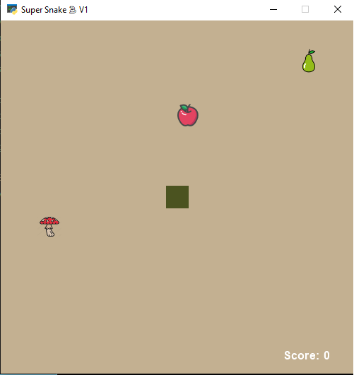
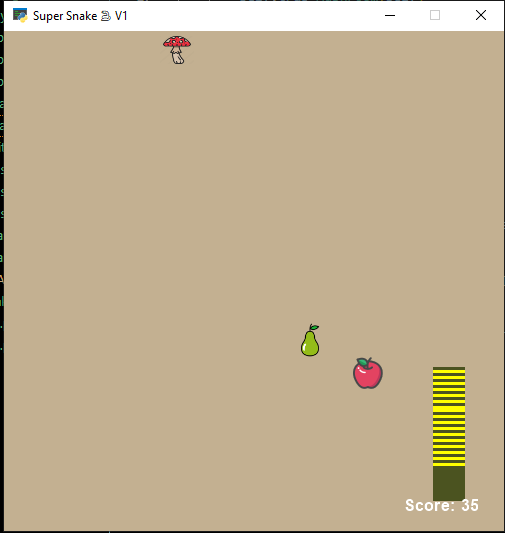
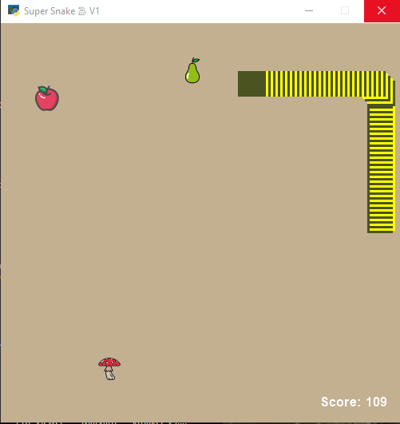
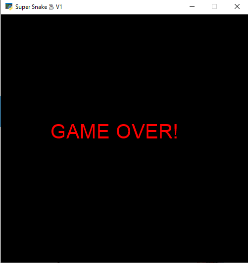

# arcadegame2
arcade- Snake Game🍎🐍 V1

## playing by user
----
language: Python

Module: [arcade](api.arcade.academy)

### Functions and Rules

movement: right/left/up/down keys
 
#### score

Each apple: 1 score (adding one unit to the snake's body)

Each pear: 2 scores (adding two units to the snake's body)

Each toxic mushroom: -1 score (removing one unit from the snake's body)

----

## playing via artifical intelligence
----
language: Python

Module: [arcade](api.arcade.academy)

----

